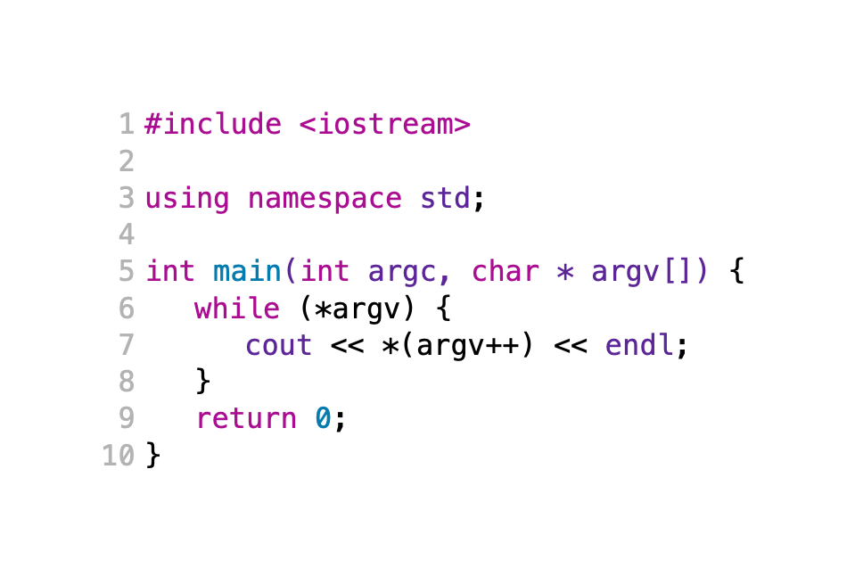
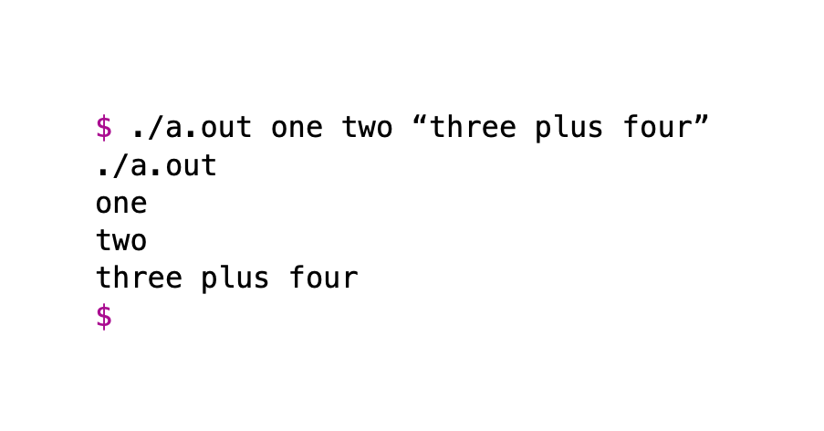
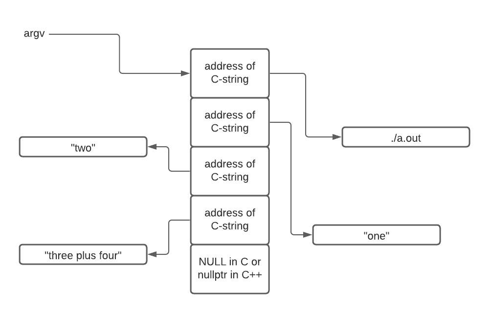
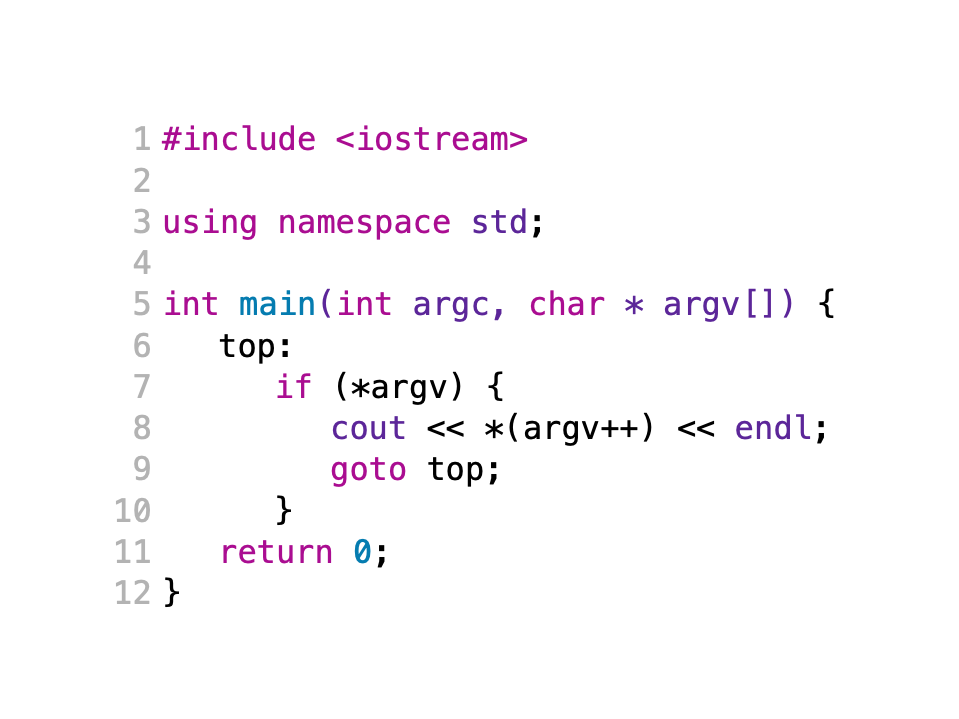
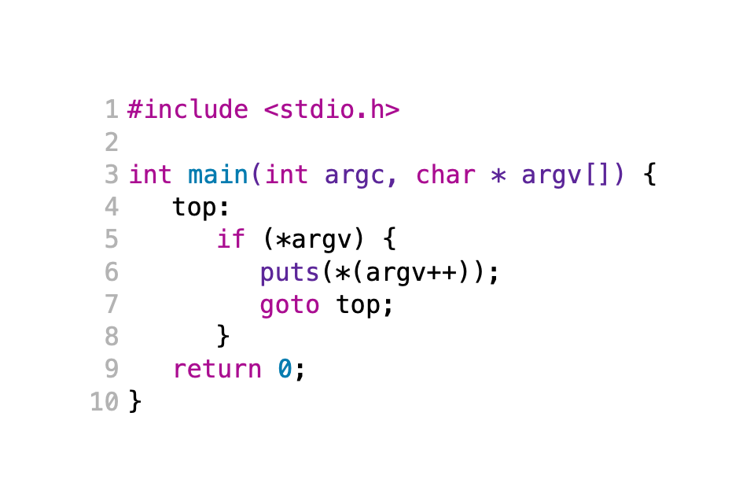
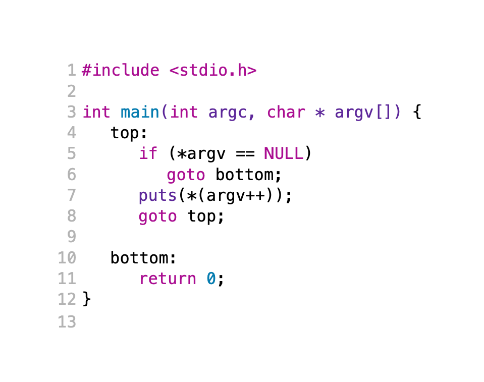
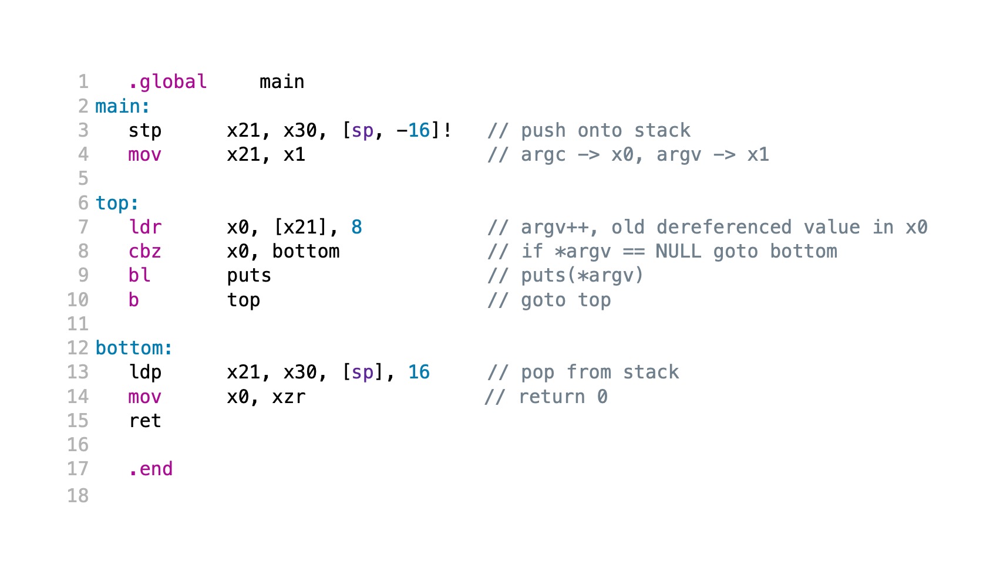

# Gentle Introduction to ARM V8 Assembly Language

## Attribution

This work is created by Perry Kivolowitz, Professor and Chair of Computer Science at Carthage College. It is copyright © 2021 and may be freely
shared for educational purposes.

## Overview

This document is a gentle introduction to ARM V8 Assembly Language.
What makes this a "gentle" introduction is that we start out with a C++
program close to "Hello World" and break it down into several versions
which are closer and closer to a high level assembly language (otherwise
known as C). Finally, we convert the C into ARM V8 assembly language.

At each step, we'll completely explain the code and document what has
changed from version to version so that little background is assumed.

Note that the assembly language conventions followed in this introduction
conforms to Linux. MacOS uses a different convention so if you're on a Mac
will need to use a VM. Similarly, on Windows you will need to use WSL (the
Windows Subsystem for Linux). We apologize for this complication but take
this step so that the same assembly language will work on the three major
platforms (which is a bit of a stretch because all three platforms devolve
to Linux).

## V1 in C++

Here is the code to a program which prints to the console the contents
of `argv`, that is: the command line arguments specified when the
program is run from the shell.



Here is the output of this program:



### Line 1

`Line 1` makes available the default output stream `cout`. `cout` stands for `c`onsole `out`put. The angle brackets (`<` and `>`) indicate the include file `iostream` comes from a language supplied directory as opposed to an
include file written by you.

For an explanation of what an `include` file is and how it fits into the compilation workflow [see here](https://youtu.be/Iv3psS4n9j8).

### Line 3

`Line 3` is a common statement in C++ programs. It allows the use of many standard library features such as `cout` by typing fewer characters. In this case, for example, `line 7` without the `line 3` `using` would read:

```c++
std::cout << *(argv++) << std::endl;
```

### Line 5

`Line 5` is a function declaration declaring `main`. In command line
programs (and indeed in many non-command line programs), a function
called `main` is necessary. In all respects save one, `main` is an
ordinary user-written function. What makes `main` special is its name
and its parameters (typically called `argc` and `argv`). A function named
`main` is special because by default it is the function at which your
code will begin execution.

`argc` is an integer argument which specifies the number of *non-null*
arguments found by following the *pointers* contained in in `argv`. We will
explain *non-null* and *pointers* later.

In the case of the execution portrayed above, `argv` would have the value
of `4`. `argc` **always** has a value of at least 1. This is because the
first command line argument accessible via `argv` is the *path* to the
program being executed. For our purposes, think of the *path* as like the *name* of the program.

`argv` is declared as a *pointer to zero or more pointers to chars*. The
concept of a *pointer* is essential to understanding assembly language.
*Pointers* are also scary for new programmers. They don't have to be. When
you see the word *pointer* used, think *address of* something.

*"pointer to a pointer"* sounds scary too but if you think of pointers as *address of*, then *"pointer to a pointer"* means something which contains the address of something else which itself hold the address of a third thing.

In this case, the first *something* is `argv`. It contains the address of
an array holding 1 or more addresses of strings.

Here is a picture depicting this:



#### Explanation of "non-null"

The above diagram also illustrates what we meant by *non-null*. *argc* contains the value of 4 in this case. Looking at the array pointed to by
`argv` you will notice **5** boxes (or *elements*) arranged in a succession
of memory locations. This type of arrangement is called an *array*.

Notice that the very last element in the array contains a `NULL` in C or
`nullptr` in C++. It is not counted by `argc` because it is, in fact, null.
By the way, null is associated with the value of `0`. We will use this
fact (that the last value in the array is `0` to our advantage).

### Line 5 Continued

One final comment about `line 5` is that it currently reads

```c++
char * argv[]
```

accentuating that array property of `argv` but it could equivalently
have been written:

```c++
char ** argv
```

accentuating the *pointer to a pointer* (i.e. two successive `*`) quality of `argv`. Here the `*` indicates *pointer*. Two in a row means *pointer to a pointer*.

### Line 6

```c++
while (*argv) {
```

introduces a `while` loop. The code (i.e. the *body* of the loop) will
repeatedly execute as long as the value inside the parenthesis is found
to be `true` (i.e. non-zero or specifically in our case *non-null*).
The evaluation of `*argv` in the while loop means the loop will repeat
as long as `argv` is the address of a memory location that does not contain
*null*.

Somewhere inside the body of the loop, the value of `argv` will be changed.
If it were not, the loop would not terminate (i.e. an *infinite loop*).

#### Line 6 could be redone as a `for` loop

`Line 6` in this case could have been written using a `for` loop:

```c++
for (int index = 0; index < argc; index++)
```

Using this approach will result in more assembly language code being
generated along with the introduction of an otherwise unneeded variable
`index`. `index` will range from `0` to `3` (stopping when index ceases
to be less than `4`). `index` would be used in figuring out which
member of `argv` is examined in each loop. We claim `index` is unneeded in
this case as we have a different way of moving through the `argv` array.

### Line 7

`Line 7` is where is action is. Firstly, `cout` will receive some value for printing. `cout` is an output stream and the `<<` indicates something is being
shoved into it - i.e. is being output.

At the end of `line 7` is `endl`. This is a C++ shorthand for printing a
new line. In total `line 7` prints something followed by advancing the
output to a new line.

#### What will be printed?

`*(argv++)` is complicated. Let's break it down.

We examine what is inside the parentheses first (as demanded by the rules
governing the *order of operations).

The value of `argv` is captured first. Recall this value is the address
of an address of some characters This value is put aside for a moment but
will be used soon.

Next the value of `argv` is incremented (the `++`). We know the value of
`argv` is captured first because the `++` comes *after* `argv`. This is
how `argv` changes so as to step through the elements of the array. At
some point `argv` will contain the address of a `0` - and thar's what
will terminate the `while` loop.

After `argv` is incremented, its **previous** value is *dereferenced* indicated
by the `*` outside the parentheses. Remember, we put the value aside before
incrementing it.

`argv` contains the address of something.
Dereferencing `argv` means "go fetch what is found at the address specified
by `argv`". That, dear reader, will be the address of the string of characters to be printed.

### Line 8

`Line 8` contains a matching brace for the opening brace found line `line 6`.
This marks the end of the `while` loop's *body*. The `}` causes a **jump**
back to evaluating what is pointed to by argv to see if it is now null (which
exits the loop). A synonym for **jump** is **branch** - remember this.

### Line 9

This program is itself invoked by another program (in this case the shell).
The value returned by `main` is received by the program which launched this program. `Line 9` causes the shell to be able to receive the value 0 which,
by convention, means our program exited normally.

Indeed, here's how to see a program's return value:

```text
$ ./a.out
$ echo $?
0
$
```

The `0` is the program's return code.

## V2

Here is version 2 of our program:



In this version, we've moved a bit closer to assembly language by eliminating
the `while` loop replacing it with an `if` statement, a `label` and a `goto`.

### Line 6

This line is a `label`. This is not an instruction, rather it is a way of specifying the address of an instruction. Labels exist in assembly language, `while` loops do not, per se. Rather, you must code them yourself using some kind of *branch* instruction (remember above the word *branch*?) in this case the `goto`.

### Line 7

The `while` loop has been removed. It has been replaced with explicit use of
an `if` statement at what was the top of the loop and a `goto` branch at what
was the bottom. This is how `while` loops are implemented - now we're
explicitly making this visible.

### Line 9

The use of `goto` is normally frowned upon in modern higher level languages.
However, the feature or ability to use it still remains. The keyword `goto` is
followed by the label to which control should transfer. `goto` is an example of a branch and the label `top` is the *target* of the branch.

## V3

In version 3 we eliminate the C++'ism of `cout`. `cout` doesn't exist in assembly language so we'll use `puts` instead to implement the same behavior
of the use of `cout` - namely the printing out of what is pointed to by
`*argv` *and* printing out a new line (done internally by `puts`).

At this point, there is no C++ left - only C.

 

### Line 6

`puts` as described above takes the address of a C string and prints it out but with the addition of a trailing new line. What's going on inside the parentheses is identical to the previous versions.

For review, the current value of `argv` is put aside for reuse in a moment.
Then `argv` is incremented. Recall that `argv` is "the address of a variable holding the address of a string." Incrementing `argv` has the effect of moving on to the next string for the *next* iteration of the loop.

Then, the *previous* value of `argv` which we set aside, is dereferenced. `*argv` is the address of a string. That string is emitted by `puts` followed
by a new line.

## Version 4

In this version we're decomposing the `if` statement even further so as to
eliminate the braces that were part of the previous version's `if` statement.

In general, braces in the higher level language serve as either branches or
as labels.



### Line 5

Notice how the sense of the `if` statement has reversed compared to the
previous version.

In the previous version, we call `puts` only if the value of `*argv` is not
null. By flipping the sense of the `if` statement, it means "if the value of
`*argv` **is** null, skip calling `puts`."

### Line 6

We exit our decomposed loop by branching to a label beyond the `goto`
implementing the bottom of what was our `while` loop.

At this point we have devolved our program into just barely above the level
of assembly language. In the next version, which is written in ARM V8
assembly language, you'll see that just about every instruction has a
one to one correspondence to the C code in version 4.

## Version 5 - in Assembly Language

Here is the same program written in ARM V8 assembly language.



Get your bearings by noticing the labels. They are the same as in our previous
version and perform the same roles.

### Line 1

`main` is a function that is specially named. `Line 1` instructs the assembler to make the name and location of `main` visible to the *linker*. To refresh your knowledge of the linker, [see here](https://youtu.be/Iv3psS4n9j8).

Without `Line 1`, building the executable will fail with an unresolved symbol error - namely that the linker could not find `main`.

### Line 2

In `Line 1` we told the assembler to publish the location of the label `main`. In `Line 2` we're actually specifying the value of `main`. Contrast `main` with `top` and `bottom`. The difference between them is that only `main` is made visible outside this source code. Again, in the case of `main`, the label must be specified as `global` so that the linker will find it. `top` and `bottom` are also labels but they are not published outside this one source file.


### Line 3

This instruction copies the value in two *registers* onto your *stack*. There's a lot of new information here.

*Registers* are ultra highspeed storage locations built into the circuitry of the processor. On the ARM, all computation takes place in the registers (with very few exceptions). In a higher level language, when you say:

```c++
x = x + 1;
```

the assembly language to implement this looks like:

```text
1. Load the address of x into a register.
2. Go to that address and fetch what it contains into a register.
3. Add one to that value (in the register).
4. Store the value back to memory using the address loaded on line 1.
```

The thing to note here is that the increment of x didn't happen in memory - it happened in a register. The value in x had to be loaded into a register, incremented in the register and finally written back to memory.

The *stack* is a region of memory used to store local variables as well as the trail of breadcrumbs which allows functions to return from whence they were invoked. In a high level language, you don't manage the stack yourself. Values go onto the stack (push) and leave the stack (pop) passively by virtue of having made function calls. In assembly language *you* manage the stack.

`Line 3` `st`ores a `p`air of registers on the stack. `stp` means *store pair*. The registers being copied to the stack are `x21` and `x30`. `x30` is special as it contains the address that this function to which this function should return. If your function makes any function calls itself (`main` does - it calls `puts`) then `x30` gets overwritten with each function call. If we don't *save* `x30` on the stack when `main` initially enters, our ability to properly return to whoever called `main` would be broken. In all likelihood when this program ended it would crash.

`x21` is also being saved on the stack. *Calling conventions* specify some registers can be blown away (used as scratch) while some registers must be preserved and restored to their previous values upon leaving the function. `x21` will be used in `main` so its original value must be preserved.

Finally let's look at `[sp, -16]!`. There's a lot going on here. 

First, the `[` and `]` serve the same purpose of the asterisk in C and C++ indicating "dereference." It means use what's inside the brackets as an address. Next, `sp` means use the stack pointer - a register which keeps track of where your stack currently is,. The `-16` subtracts 16 from the current value of the stack register. `x` registes like `x21` and `x30` are each 8 bytes (64 bits) wide. This accounts for the value 16 (i.e. 2 \* 8). Lastly, the exclamation point means that the stack pointer should be changed (i.e. the -16 applied to it) before the value of the stack pointer is used as the address in memory to which the registers will be copied.

The stack pointer in ARM V8 can only be manipulated in multiples of 16.

In a higher level language `Line 3` would look like this:

```c++
*(--sp) = x21;
*(--sp) = x30;
```

That is, subtract 8 from the stack pointer and put `x21` at that location. Then, subtract 8 from the stack pointer and put `x30` at that location.

### Line 4

When a function is passed parameters, up to 8 of them can be found in the first 8 scratch registers (`x0` through `x7`). Recall:

```c++
main(int argc, char ** argv)
```

`argc` is the first parameter. It shows up to the function in register `x0`. This is a slight oversimplification because `x` registers are 64 bits wide and `int` is 32 bits wide. The simplification isn't relevent here so let's continue.

`argv` is the second parameter to `main`. Being second, it shows up in `main` in register `x1`. `x0` through `x7` are truely scratch registers - they can be overwritten with new values at any time. Because of this, `argv` that arrives in `x1` is preserved in `x21` (whose original value we preserved on the stack).

```asm
mov   x21, x1
```

can be read as `copy what is in x1 into x21`.
