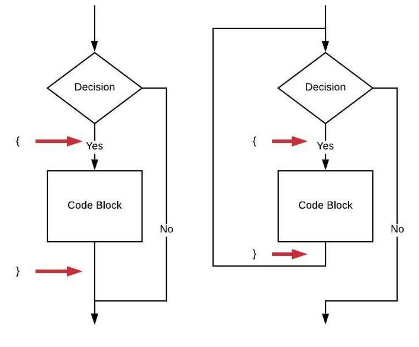
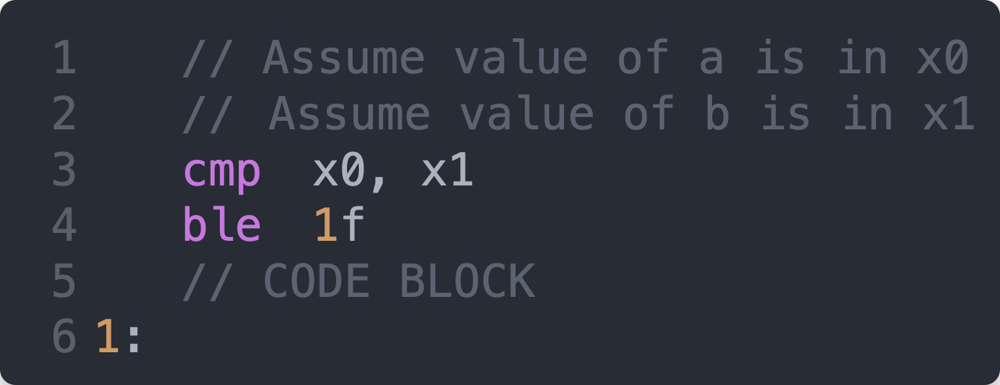

# Review Focusing on Braces

## Attribution

This work is created by Perry Kivolowitz, Professor and Chair of Computer Science at Carthage College. It is copyright © 2021 and may be freely shared for educational purposes.

## Overview

This chapter reviews how braces make their way into assembly language.

While the symbols `{` and `}` don't carry over per se, the effect of braces is clearly required.

`{` *can* appear as labels (example in a `do-while` loop).

`}` *can* appear as branches. If a branch, a label typically appears on the next line *after* the branch.

## Braces in a Flowchart

The flowchart on the left depicts an `if` statement.

The flowchart on the right depicts a `while` loop.

In `C` and `C++`, braces surround code blocks (they also define scopes, but scope is a compiler concept). Yet, braces don't appear in flowcharts. Nor do they appear in assembly language.

In an `if` statement, the opening brace is not depicted per se, but you can see where it would be, coming just before the code block. The closing brace also is not depicted *but* you can see where it would be, coming just after the code block. A label in the assembly language would come just after where the closing brace would be so that the decision code has a target to branch to depending on the outcome of the decision.

In a `while` loop, the opening brace works just like the `if` statement. The closing brace in a loop shows up explicitly in assembly language in the form of a branch. As in the `if` statement closing brace, a label is found after the branch so that the decision code has a target to which to branch depending upon the outcome of the decision.

## Braces in an `if` Statement

Recall:

The location of the opening brace "is" immediately before `line 5`. The location of the closing brace "is" immediately after `line 5`. In short, where the braces *would* be is surrounding the code block.

Notice that after the location of where the closing brace would be, a label is found. This is the target of the branch found on `line 4`.

## Braces in a `while` Loop

Recall:

The opening brace "comes" immediately before `line 6`. The closing brace shows up as the branch on `line 7`. Again, there is a label immediately after where the closing brace would be so that the branch on `line 5` can skip over the code block implementing the body of the `while` loop.
