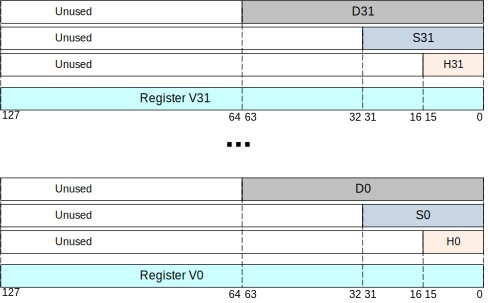
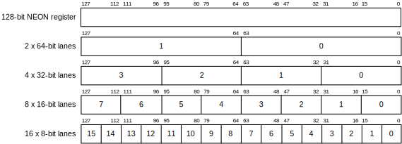

# Barely Begun Chapter Relating to Floats and NEON

The program below demonstrates a number of concepts relating to processing of floats,
double precision and vector (NEON) instructions.

```text
        .text                                                                    // 1 
        .align  4                                                                // 2 
        .global main                                                             // 3 
                                                                                 // 4 
//  This example demonstrates 4 concepts.                                        // 5 
//  1. Loading 4 floats from memory.                                             // 6 
//  2. A NEON (SIMD) operation on all four simultaneously.                       // 7 
//  3. Up-conversion from single to double precision.                            // 8 
//  4. Passing floats to a "C" function (printf in this case)                    // 9 
                                                                                 // 10 
main:   str     x30, [sp, -16]!                                                  // 11 
        ldr     x7, =fa                     // get base address of array         // 12 
        ldr     q0, [x7], 16                // load up all 4 fa                  // 13 
        ldr     q1, [x7], 16                // load up all 4 fb                  // 14 
        fadd    v7.4s, v0.4s, v1.4s         // NEON add of all 4 floats          // 15 
        ldr     x0, =fmt                                                         // 16 
                                                                                 // 17 
        // printf only prints double precision floats.  After extracting         // 18 
        // a single precision float from the vector register, it must be         // 19 
        // converted to double precision - fortunately, this can be done         // 20 
        // in place. In C, the compiler performs the cast.                       // 21 
                                                                                 // 22 
        // NOTE! - NOTE! - NOTE! - NOTE! - NOTE! - NOTE! - NOTE! - NOTE!         // 23 
        // Notice the first float parameter  is going  in the 0 register         // 24 
        // not the 1  register which you  might think  would be the case         // 25 
        // since the  first  float  parameter is the SECOND parameter to         // 26 
        // printf. This is true in general - sequence of float registers         // 27 
        // starts counting at 0 THEN increases as you would expect.              // 28 
                                                                                 // 29 
        mov     s0, v7.s[0]                 // extract 1st float                 // 30 
        fcvt    d0, s0                      // cast to double                    // 31 
        mov     s1, v7.s[1]                 // same for 2nd float                // 32 
        fcvt    d1, s1                      // etc                               // 33 
        mov     s2, v7.s[2]                 //                                   // 34 
        fcvt    d2, s2                      //                                   // 35 
        mov     s3, v7.s[3]                 //                                   // 36 
        fcvt    d3, s3                      //                                   // 37 
        bl      printf                      // print                             // 38 
                                                                                 // 39 
        ldr     x30, [sp], 16                                                    // 40 
        mov     w0, wzr                                                          // 41 
        ret                                                                      // 42 
                                                                                 // 43 
        .data                                                                    // 44 
fa:     .single 1.0, 2.0, 3.0, 4.0          // array of 4 floats used as srca    // 45 
fb:     .single 100.0, 101.0, 102.0, 103.0  // array of 4 floats used as srcb    // 46 
                                                                                 // 47 
        .section    .rodata                                                      // 48 
fmt:    .asciz      "%f %f %f %f\n"                                              // 49 
                                                                                 // 50 
        .end                                                                     // 51 
```

## NEON

The NEON instruction set is an addition to the AARCH64 ISA. This addition is optional on ARM processors - it may or
may not be present on a particular ARM CPU. The NEON instruction set is an example of a SIMD instruction set.

SIMD stands for:

- Single
- Instruction
- Multiple
- Data

The native width of an ARM floating point register is 128 bits. This is twice the width of the general purpose X registers. There are 32 floating point registers subject to a similar aliasing systems used with X (and W) registers.



| Register | Width (bits) | Usage |
| -------- | ----- | ----- |
| V | 128 | vector instructions |
| Q | 128 | non-vector superwide |
| D | 64 | double precision |
| S | 32 | single precision |
| H | 16 | half precision |

V registers can be easily broken down into pieces as in `Line 30` in the program above which extracts the first single precision value in a V register, putting it into an S register by itself.

For NEON instructions, the interpretation of each V register is defined when you name it in the instruction: V[*register number*].[*number of primitives*][*size of primitives*]. For an example, see `Line 15` of the program above which performs a NEON `add` on four single precision floats simultaneously.



### Vector instructions for scientific computing

Solving matrix equations are extremely important in many fields. More to come here.

## Q registers

The Q register alias is handly for moving multiple floats (any precision) into a vector register. Q registers are also handy for use as intermediate registers for bulk copying of memory (covered elsewhere).
