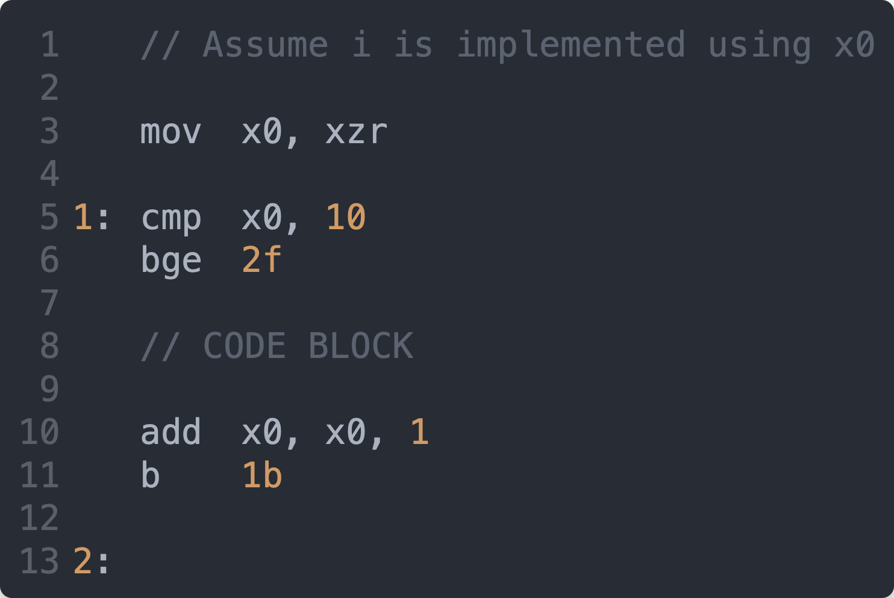
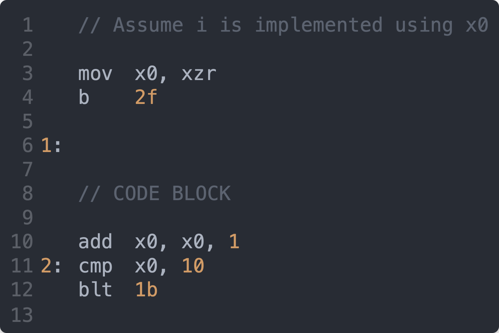

# For Loops

**REDO THIS PUTTING BOTH POST STEP AND DECISION AT THE BOTTOM.**

## Attribution

This work is created by Perry Kivolowitz, Professor and Chair of Computer Science at Carthage College. It is copyright © 2021 and may be freely
shared for educational purposes.

## Overview

We have already covered the [`if`](./if.md) and [`while`](./while.md) statements. We demonstrate that a `while` loop is nothing more than an `if` statement with one additional label preceding and one unconditional branch following the code for an `if` statement.

A `for` loop is only slightly more complex.

## In `C`

In `C`, a for loop looks like this:

## In Assembly Language

In assembly language there are different ways of representing a `for` loop. We'll represent it like this first:

Notice how we perform the set up step then skip over the post step before the first loop. Thereafter, we have a `while` loop which includes the post step before the evaluation of the boolean condition. *Organizing the code for a `for` loop in this way makes the implementation of a `continue` statement trivial (not shown in this first example).

## Concrete Example

Given this code:

would be implemented like this in assembly language:

### Line 3

`Line 3` causes us to skip from the set up code directly to the evaluation of the decision. This skips over the increment (serving as our post step). This branch happens just once.

### Line 5

`Line 5` implements the post step, in this case an increment of the loop counter. Then, execution falls through to the evaluation of the decision, as you would expect. By doing it this way, `continue` is implemented in exactly the same way as the end of a loop. Not doing it this way will cause extra code to be necessary to implement a `continue`.

## Implementing a `continue`

### If the Post Step Came at the End

Here is the same code but with the post step moved to the end of the code block:

