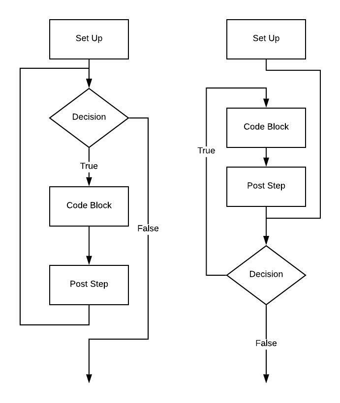
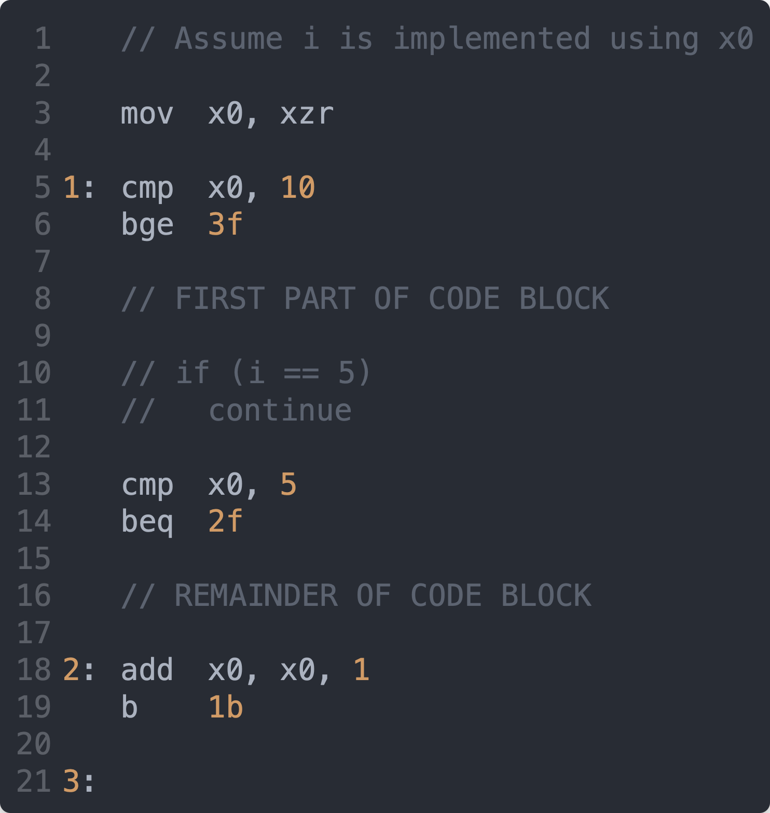
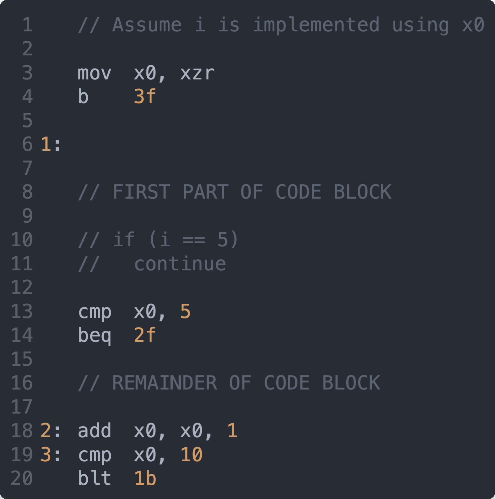

# For Loops

## Attribution

This work is created by Perry Kivolowitz, Professor and Chair of Computer Science at Carthage College. It is copyright © 2021 and may be freely
shared for educational purposes.

## Overview

We have already covered the [`if`](./if.md) and [`while`](./while.md) statements. We demonstrate that a `while` loop is nothing more than an `if` statement with one additional label preceding and one unconditional branch following the code for an `if` statement.

A `for` loop is only slightly more complex.

## In `C++` and `C`

In `C++` and `C`, a for loop looks like this:

```c++
    for (set up; decision; post step)                                   // 1 
    {                                                                   // 2 
        // CODE BLOCK                                                   // 3 
    }                                                                   // 4 
```

## How You Picture It Versus How It is Implemented

The image on the left, below, represents from top to bottom what the parts of the `for` are from left to right (the post step being found at the bottom).



The image on the right, above, depicts how `for` loops are *typically* implemented. The reason for this becomes clear when we see the assembly language.

## In Assembly Language

This code:

```c++
    for (long i = 0; i < 10; i++)                                       // 1 
    {                                                                   // 2 
        // CODE BLOCK                                                   // 3 
    }                                                                   // 4 
```

could be implemented like this in assembly language:

```asm
    // Assume i is implemented using x0                                 // 1 
                                                                        // 2 
    mov     x0, xzr                                                     // 3 
                                                                        // 4 
1:  cmp     x0, 10                                                      // 5 
    bge     2f                                                          // 6 
                                                                        // 7 
    // CODE BLOCK                                                       // 8 
                                                                        // 9 
    add     x0, x0, 1                                                   // 10 
    b       1b                                                          // 11 
                                                                        // 12 
2:                                                                      // 13 
```

This corresponds to the flow chart on the **left**, above. There are 4 instructions in the loop (ignoring the code block).

The next set of assembly language corresponds to the flow chart on the right, above, where the post step and decision comes *after* the code block.

```asm
    // Assume i is implemented using x0                                 // 1 
                                                                        // 2 
    mov     x0, xzr                                                     // 3 
    b       2f                                                          // 4 
                                                                        // 5 
1:                                                                      // 6 
                                                                        // 7 
    // CODE BLOCK                                                       // 8 
                                                                        // 9 
    add     x0, x0, 1                                                   // 10 
2:  cmp     x0, 10                                                      // 11 
    blt     1b                                                          // 12 
                                                                        // 13 
```

Notice this contains one fewer lines of assembly language within the loop itself (3 lines versus 4). Again, the contents of the code block are not counted.

## Implementing a `continue`

Now let's add a `continue` to the code block, dividing it in two. 

Here is what we would need to write to support a `continue` if the "conventional" ordering were used with the decision evaluation at the top:



Below, is how a `for` loop is **typically** implemented.



Once again, the code moving the post step and decision evaluation to the bottom is one fewer instruction inside the loop.

## Summary

`for` loops typically contain code ordering different from what one might expect. This is done to save an instruction. While this doesn't sound like much, consider the case where the loop is executed billions of times. In this case, saving one instruction per loop prevents the execution of a billion instructions.
The shorter the code block is, the more important it is to save one instruction from within the loop.
