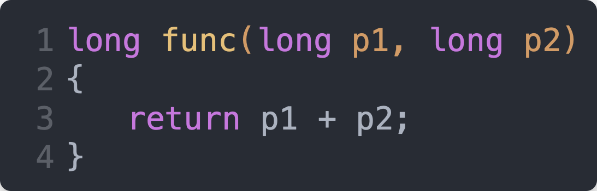
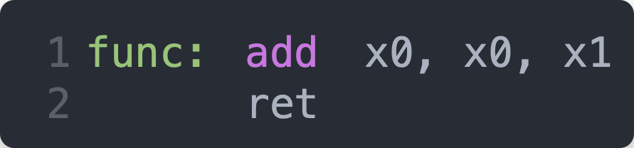
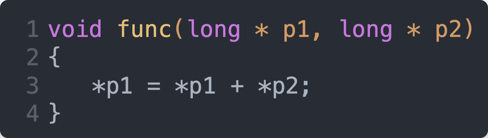
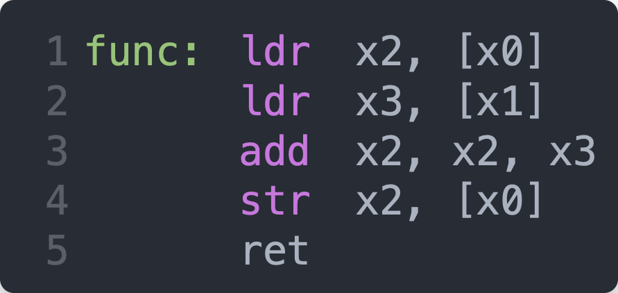
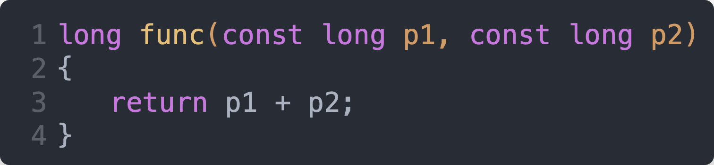
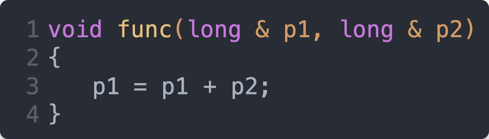

# Function Calls and Returns

Calling functions, passing them parameters and receiving back return values is basic to using `C` and and `C++`. Calling methods (which are functions connected to classes) is similar but with enough differences to warrant its own discussion to be provided later in the chapter on [structs](./structs.md).

## Bottom Line Concept

The name of a (non-inline) function ultimately becomes a label to which a branch can be made. Not an unconditional branch as implemented by the `b` instruction not the conditional branches as implemented by instructions such as `ble` or `bgt`. Rather, function calls are made using the `bl` instruction is stands for **B**ranch with **L**ink. The **link** concept is what enables a function (or method) to **return** to the instruction after the function call.

*Note: this chapter is only a first pass at functions and parameter passing. To fully explore functions and methods, additional knowledge is required.*

## A Trivial Function

In `C`, here is the most trivial function possible:


The function `func()` takes no parameters, does nothing and returns nothing.

Here it is in assembly language.


To call this function in `C` you would do this:


This would be done in this way in assembly language:


Notice that calling a function **is** a branch. But it is a special branch instruction - *branch with link*. It is the *link* that allows the function to `ret`urn.

## Passing Parameters

Up to 8 parameters can be passed directly via registers. Each parameter can be up to the size of an address, long or double (8 bytes). If you need to pass more than 8 parameters or you need to pass parameters which are larger than 8 bytes or are `structs`, you would use a different technique described later.

For the purposes of the present discussion, we assume all parameters are `long int` and are therefore stored in `x` registers.

Up to 8 parameters are passed in the scratch registers (of which there are 8). These are `x0` through `x7`. *Scratch* means the value of the register can be changed at will without any need to backup or restore their values.

For example:



is implemented as:



The first parameter (`p1`) goes in the first scratch register (`x0`). It's `x` because it is a `long int` and its `0` because that is the first scratch register.

The second parameter (`p2`) goes in the second scratch register because it is the second argument, and so on.

`Line 1` of the assembly language provides the label `func` to which a `bl` can be made.

`Line 1` also provides the full body of the function - the third argument to `add` is added to the second and the result is put in the first. Thus is: `x0 = x0 + x1`.

`longs` that are returned are passed in `x0`. The result of the addition is already sitting in `x0` so all we do is `ret` on `Line 2`.

## Passing Pointers

A pointer is an address. The word *pointer* is scary. The words *address of* isn't as scary. They mean **exactly** the same thing.

Here is a function which *also* adds two parameters together but this time using pointers to `long int` rather than the values themselves.



`Line 1` passes the *address of* `p1` and `p2` as parameters. That is, the addresses of `p1` and `p2` are passed in registers `x0` and `x1` rather than their contents. Their contents still reside in memory.

`Line 3` *dereferences* the addresses to fetch their values. The values are added together and the result is stored to the address specified by `p1`.

Here it is in assembly language:



The `add` instruction cannot operate on values in memory. With little exception, all the *action* takes place in registers, not memory.

`Line 1` provides the label to which `bl` can branch with link.

Remember that up to the first 8 parameters are passed in the 8 scratch registers. Thus, the address of `p1` and the address of `p2` are stored in `x0` and `x1` respectively.

`Line 1` also dereferences the address held in `x0` going out to memory and loading (`ldr`) the value found there into `x2`, another scratch register. It's scratch so it doesn't need backing up and restoring.

`Line 2` does the same for `p2`, putting its value in `x3`.

Why didn't we reuse `x0` and `x1` as in:

```asm
   ldr   x0, [x0]
   ldr   x1, [x1]
```

We certainly could have, but doing so would blow away the address of `p1`. This would prevent us from copying the result of the addition back into memory since the address to which we would want to store the result of the addition would be blown away. Can't have that.

So, as the smart *human*, we decided to use `x2` and `x3` because, well, they're scratch.

`Line 3` performs the addition.

`Line 4` stored the value in `x2` at the address in memory still sitting in `x0`.

### `const`

Suppose we had:



how would the assembly language change?

Answer: no change at all!

`const` is an instruction to the compiler ordering it to prohibit changing the values of `p1` and `p2`. We're smart humans and realize that our assembly language makes no attempt to change `p1` and `p2` so no changes are warranted.

### Passing by Reference

Suppose we had:



how would the assembly language change?

Answer: no change at all!

Passing by reference is also an instruction to the compiler to treat pointers a little differently - the differences don't show up here so there is no change needed to the assembly language we wrote to handle passing pointers.
