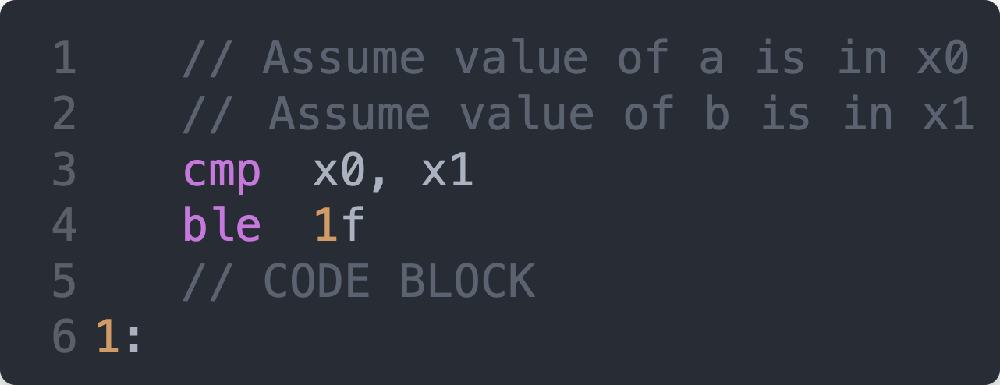

# The `if` statement

We will begin with the `if` statement followed by a discussion of the `if / else`.

`if / else if` is not discussed as it is a repeat of the discussion provided here.

## `if` in `C`

Here is a basic `if` statement in `C`:

For simplicity, let us assume that both `a` and `b` are defined as
`long int`. This means `x` registers will be used in the assembly language.

## `if` in `AARCH64`

Here is the above `if` statement rendered into `AARCH64` assembly language:

`Lines 1` and `2` indicate that the values currently in the variables `a` and `b` are
found in registers `x0` and `x1` respectively. Values in memory cannot be operated upon.
They can be loaded into a register and they can be overwritten from a register. All
action takes place in registers. The choice of `x` registers is made based on the
assumption that `a` and `b` are `long`.

### Line 3

The `cmp` instruction is actually a shorthand for a subtraction instruction that
discards the result of the subtraction but keeps a record of whether or not the result
was less than, equal to or grater than zero.

The second operand is subtracted from the first.

This means that the condition bits (status of the previous computation) are formed using
`x0 - x1`. If `a > b` then `x0 - x1` will be positive.

### Line 4

Using the state of the condition bits (which are set by the faux substraction of `x1`
from `x0`), branch if the previous computation shows `less than or equal to` zero. Notice
the use of the *opposite* condition as found in the `C` code.

**In the higher level language, you want to *enter* the following code block if the condition
is true. In assembly language, you want to *avoid* the following code block if the condition
is false.**

### Use of temporary labels

The target of the branch instruction is given as `1f`. This is an example of a temporary
label.

**Assembly language can use a lot of labels as, for example, labels frequently take the place of `{` and `}`.**

A temporary label is a label made using just a number. Such labels can appear over and over
again. They are made unique by virtue of their placement relative to where they are being used. `1f` looks `f`orward in the code for the next label `1`. `1b` looks in `b`ackward direction for the most recent label `1`.

### Line 6

This line acts in place of the `if` statement's closing `}`.

## `if` / `else`

Here is a basic `if` / `else`:

**There is built-in here two branches!**

First, the *true* block has to be skipped over if the condition is *false*.

Second, the *true* block (if taken) must skip over the *false* block.

Here is the corresponding assembly language.

### Line 7

`Line 7` acts like the `{` in the `else`.

### Line 9

`Line 9` acts like the `}` of the `else`.

## A complete program

Without further explanation, here is a complete program you can play around with:

