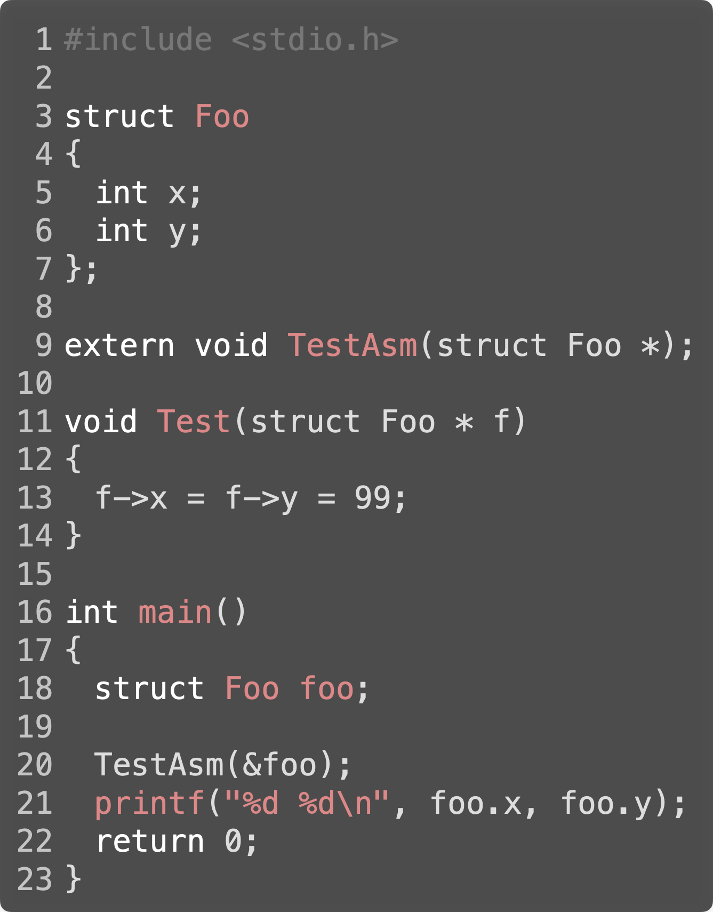
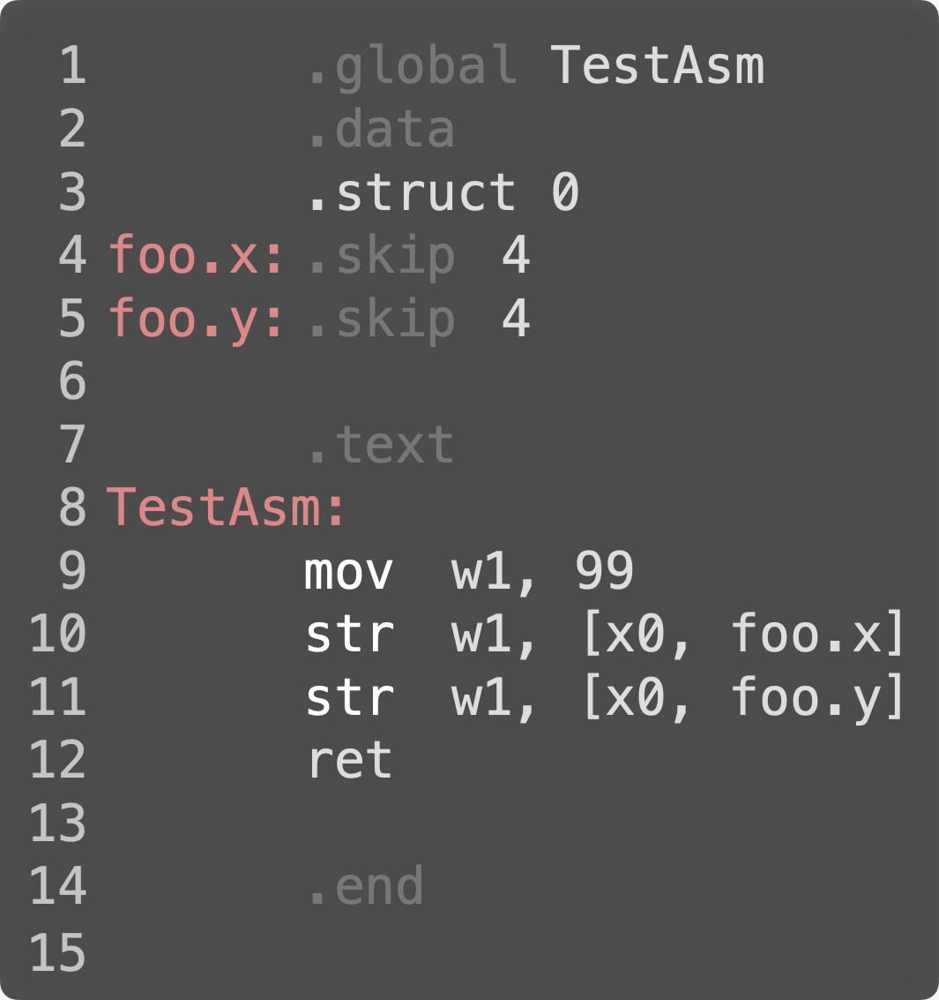

# Calling Assembly Language From `C` and `C++`

## Attribution

This work is created by Perry Kivolowitz, Professor and Chair of Computer Science at Carthage College. It is copyright © 2021 and may be freely shared for educational purposes.

## Overview

This document demonstrates how assembly language functions can be called from `C` and `C++`.

*The assembly language function we will use in this document is trivial in that it makes no function calls of its own. If it did, backing up and restoring registers such as `x29` and `x30` would be required!*

Additionally, the example program demonstrates passing the address of a `struct` to an assembly language function. In the assembly language, we'll get some practice making use of `struct` using a different syntax (i.e. not `.equ`) which some might find more friendly.

## Our `C` Program



The actual code is [here](../struct/test.c).

`Lines 3 to 7` define a `struct` containing two 4 byte wide `int` members. As we saw in our introduction to using `structs` (found [here](../struct/structs.md)), it is essential that we know the in-memory layout of the data members. Without an accurate knowledge of the layout, we cannot make use of a `struct` in assembly language.

`Line 9` is critical. It is informing the `C` compiler that the name `TestAsm` will be found **in another file** and that it has one argument which is a pointer.

For a video about how symbols in different files get *linked* up, see [here](https://youtu.be/Iv3psS4n9j8).

Foreshadowning how to interoperate with `C++` `line 9` is the only line that would change... just a little!

`Lines 11 to 14` is a `C` version of the assembly language we will implement. It simply loads a constant into both data members.

`Line 18` declares an instance of the `struct` `Foo` as a local variable inside `main()`. The effective difference between declaring this instance as a local versus a global is that being a local, its initial contents is *garbage*. We choose to make it a local precisely for this reason. It will be very obvious if the assembly language function doesn't do its job correctly.

`Line 20` calls our assembly language function, passing it the address of our `struct`.

`Line 21` prints out the values of the `struct's` data members.

## Our Assembly Language Function



The actual code is [here](../struct/testasm.s)

`Line 1` is critical. It exposes the symbol `TestAsm` outside this file. Without this line, linking the final executable would fail with an unresolved symbol.

`Line 2` says that what comes next is data and not code.

`Line 3` introduces a *different* way of establishing the offsets of the `struct` data members than explained [here](../struct/structs.md). This way might be friendlier to those knowledgable in `C` and `C++`.

`.struct` is an assembler directive that allows us to define the offsets of the data members without having to do some of the math necessary if the more general `.equ` is used. The parameter of 0 says "start counting at 0."

`Lines 4 and 5` establish the values (and names) of the offsets to the data members in the `struct`. The `.skip`s are assembler directives that leave the specified number of bytes between the current location and that next. We're modeling two 4 byte `ints`, hence the value of 4 for each.

`Line 7` says that what comes next is code.

`Line 8` specifies the address to which a call to `TextAsm` will branch. Once again, this requires `line 1` in order to be visible outside this file.

`Line 9` initializes `w1` with a constant value. A `w` register is used because we will be poking into 4 byte memory locations. The `1` register is used so as to avoid the `0` register which contains the pointer to our `struct` being passed to us as our parameter.

`Lines 10 and 11` store the contents of `w1` into the data members in the `struct`. The base addres of the `struct` is found in `x0`. We use an `x` register because it holds an 8 byte wide address. We use the `0` register because we get this value as the first parameter to a call to this function.

`Line 12` returns to from where we were called. This is a `void` function so we do not care about what we're returning (which in this case is the base address of the `struct` we were passed that's still sitting in `x0`).

### Anecdote

[Stephen Bourne](https://en.wikipedia.org/wiki/Stephen_R._Bourne) tells the story of how `void` functions were added to the `C` language. As he tells it, people would approach [Dennis Ritchie](https://en.wikipedia.org/wiki/Dennis_Ritchie) about things to add to `C` to which Dennis invariably said no. Prior to the addition of `void` functions, a function that had no meaningful return value still had to return something (since there was no `void` return type).

Bourne approached Ritchie with the idea of `void` functions with the explanation that requiring every function to return something, functions which didn't need to return anything contained an extra assembly language instruction (needed to initialize the return value). Ritchie jumped at the opportunity to save one instruction per applicable function as there were so many. At one instruction each, a large amount of memory was saved and execution speed increased.

Please excuse me acting like a fanboy for a moment... Here's my picture of Ritchie taken at the 1983 USENIX Conference.


### End of Anecdote

Building and running the program does what we expect:

```text=
struct > gcc -g test.c testasm.s 
struct > gcc -Wall -g test.c testasm.s 
struct > ./a.out
99 99
struct >
```

## `C++`

If we wanted to use `TestAsm()` from `C++` rather than `C`, only one line would have to change. `Line 9` of the `C` would have to be changed to:

```c++=
extern "C" void TestAsm(struct Foo *);
```

The addition of `"C"` is critical because `C++` functions aren't actually named what you might think they are. It turns out that function overloading is an elegant trick performed by the `C++` compiler.

Suppose you had:

```c++=
extern void Foo(int i);
extern void Foo(double f);

void Bar()
{
    Foo(7);
    Foo(7.0);
}
```

you will find that the symbol `Foo()` will **not** be found.

Instead you will find `_Z3Fooi` and `_Z3Food`. This is called *name mangling*. Function overloading works by encoding the parameters and their types into the name of the actual function emitted rather than its unmangled name.

