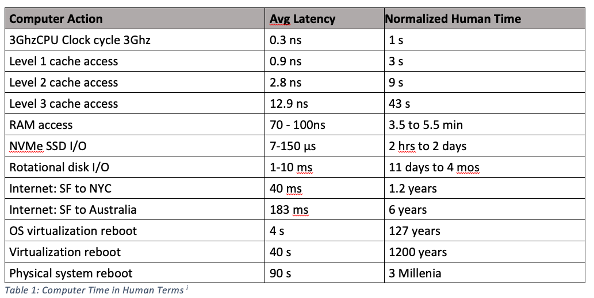
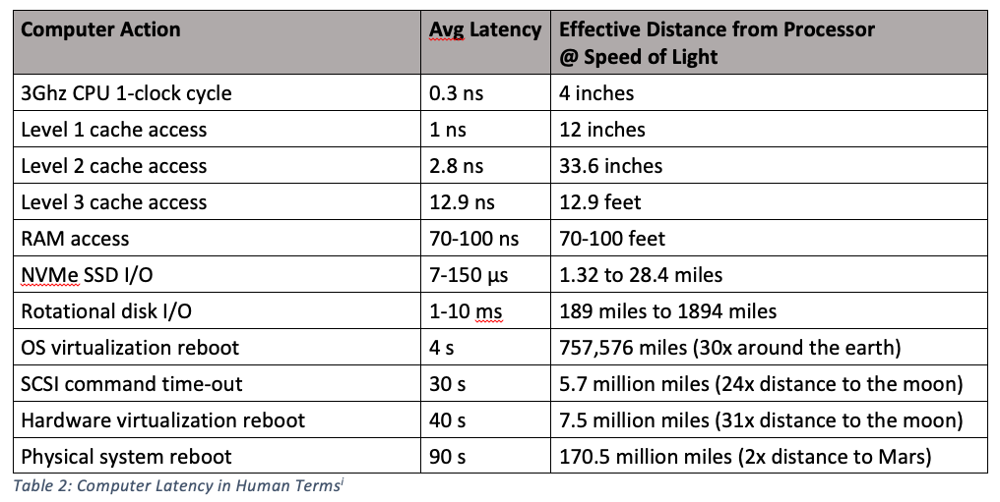
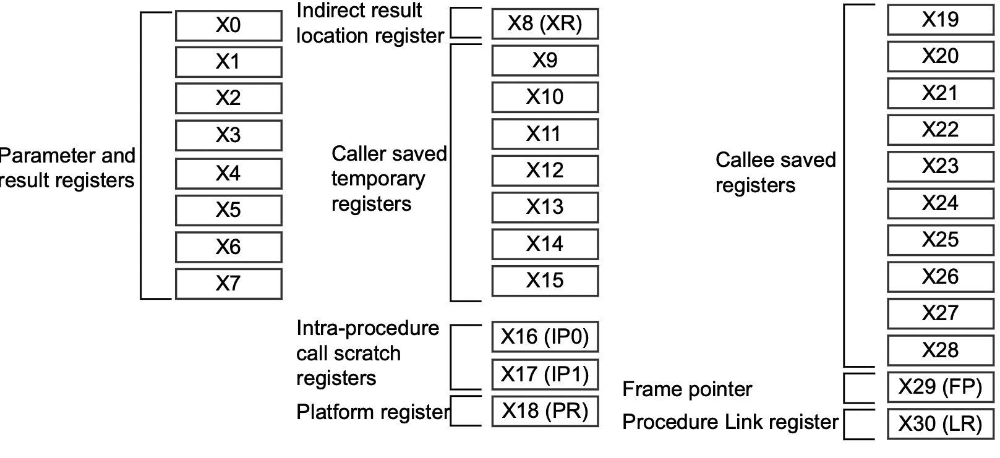

# Registers Versus Variables

It is important that you become familiar with all the different kinds and uses of registers available on the AARCH64 ISA. We'll dive into this soon. But first, it is vitally important to expand upon your notion of "variable."

In most (all?) of the programming you may have done prior to learning assembly language, you've taken it for granted that variables are located somewhere in RAM. This has been a convenient fiction. In reality, virtually all interaction with a variable takes place in a register rather than in RAM. Modern processors have fewer and fewer instructions that operate directly upon data in RAM. This is largely because of the stupendous difference in speed at which a processor can access its registers versus the speed at which a processor can access memory.

The following two images are from the [Formulus Black Blog](https://formulusblack.com/blog/compute-performance-distance-of-data-as-a-measure-of-latency/) and are quite informative.

This image relates typical latency (delay) in gaining access to data is various places.

This says that if we liken accessing a register (which can be done at *least* once per CPU Clock Cycle) to one second, accessing memory would be like a 3.5 to 5.5 minute wait.

In the next image, the relative latencies within a computer are expressed in a different way: What is the *effective distance* of a device from the CPU expressed in terms of the *speed of light.* Here, registers can be tought of as being less than 4 inches away from the CPU. Main memory, on the other hand, would be 70 to 100 feet away.

THIS IS NOT FINISHED.

----

So far we have restricted our discussion of registers almost exclusively to the `x` registers. These are 8 bytes wide and are used for both signed and unsigned integer operations.

The above image is due to ARM and is found [here](https://documentation-service.arm.com/static/5fbd26f271eff94ef49c7018).
