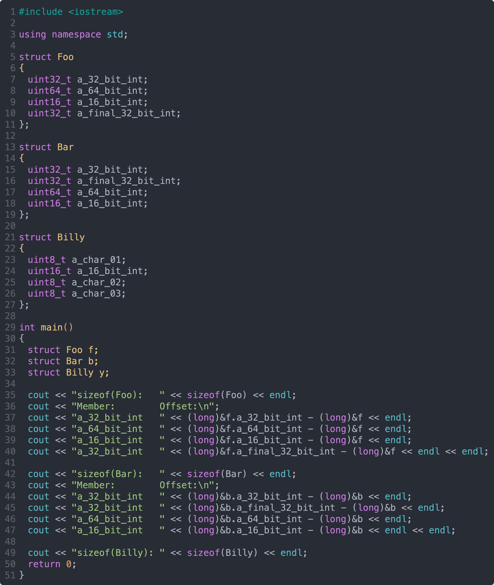
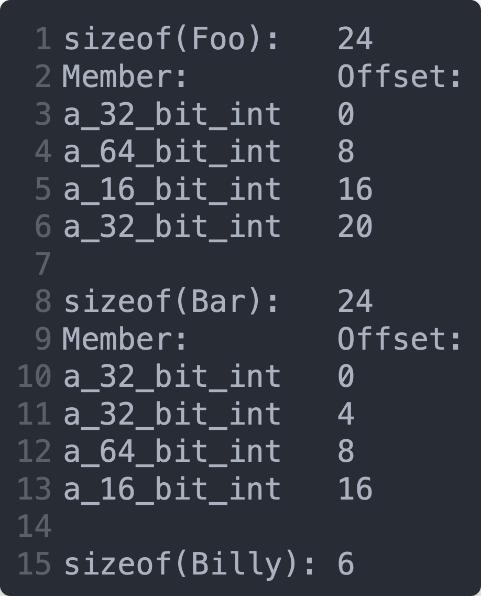

# `Structs` (and to Some Degree `Classes`) in Assembly Language

A `struct` is a bundle of data members laid out consecutively in RAM with the restriction that each memory begins on an address that is divisible by the member's length (its *natural alignment*). This can result in internal fragmentation or *gaps* between the members.

The total size of a struct may be rounded upward so that the first member will land on its natural alignment if two `structs` of the same type were placed next to each other as in, for example, an array.

Here are some examples:

Looking at `Foo`, one might expect `a_64_bit_int` to start at offset 4. After all, `a_32_bit_int` is 4 bytes.

Here is the output produced by the above program. You'll see some unexpected values:

`Line 4` shows `a_64_bit_int` starts at offset 8 rather than 4. This is because the natural alignment of an 8 byte value is on addresses that are divisible by 8.

## The First Rule of Working with `Structs`

The first rules of working with structs is that you must be sure of the offset of each data member from the beginning of the `struct`. You might need to go so far as writing a program to dump offsets just as we did above.

## After That, It's Easy

Once you are certain of the offsets of each data member, using structs in assembly language becomes quite straight forward. A data member can be found at the address corresponding to the data member's offset from the beginning of the struct.

