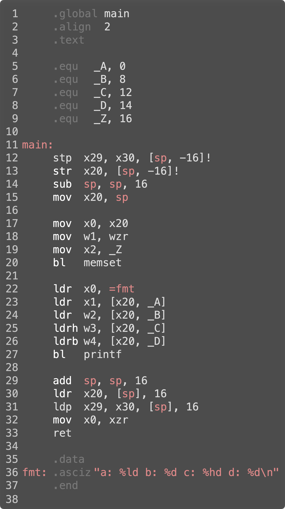

# `Structs` (and to Some Degree `Classes`) in Assembly Language

A `struct` is a bundle of data members laid out consecutively in RAM with the restriction that each memory begins on an address that is divisible by the member's length (its *natural alignment*). This can result in internal fragmentation or *gaps* between the members.

The total size of a struct may be rounded upward so that the first member will land on its natural alignment if two `structs` of the same type were placed next to each other as in, for example, an array.

Here are some examples:


Looking at `Foo`, one might expect `a_64_bit_int` to start at offset 4. After all, `a_32_bit_int` is 4 bytes.

Here is the output produced by the above program. You'll see some unexpected values:


`Line 4` shows `a_64_bit_int` starts at offset 8 rather than 4. This is because the natural alignment of an 8 byte value is on addresses that are divisible by 8.

## The First Rule of Working with `Structs`

The first rules of working with structs is that you must be sure of the offset of each data member from the beginning of the `struct`. You might need to go so far as writing a program to dump offsets just as we did above.

## After That, It's Easy

Once you are certain of the offsets of each data member, using structs in assembly language becomes quite straight forward. A data member can be found at the address corresponding to the data member's offset from the beginning of the struct.

## First Example

Let's implement this program:


The `struct` has four data members in each of the common integer sizes. `Line 14` allocates a `struct` as a local variable. We will see that local variables are stored on the *stack*.

`Line 15` uses `memset()` to initialize the entire `struct` to zeros. The first argument specifies the base address of the `struct`. The second argument is interpreted as a single byte containing the value to replicate into memory. The third argument is the number of bytes to replicate.

`Line 16` is a `printf()` which prints each of the data members in the struct. In case you are not familiar with `printf()`, its first argument is a template string which tells `printf()` the type of each argument to be printed. 

* `%ld` says put a `long` here.
* `%d` says put an `int` here.
* `%hd` says put a `short` here.

The final `char` will be cast as an `int`.

Here is an assembly language version of the same program.



`Lines 1` to `Line 10` contain assembler *directives*. These are commands to the assembler, not code to be assembled.

`Line 1` instructs the assembler to expose the symbol `main` to the linker. Without this directive, the linker will not be able to find `main` so the program will not link.

`Line 2` instructs the assembler to emit whatever is next at an even address.

`Line 3` says that what comes next is code.

`Line 5` through `line 9` are equivalent to `#define` in `C` and `C++`.

These lines are giving symbolic names to what otherwise would be magic numbers. In this case, the first 4 are the offsets of each data member in the `struct` and the last is the size of the `struct`.

`Line 12` uses the *store pair* of registers to memory. `sp` stands for *stack pointer*. This instruction is backing up the contents of registers `x29` and `x30` on the stack.

`Line 12` is essentially this made up `C` code:

```c
// assume long * sp;
*(--sp) = x30;
*(--sp) = x29;
```

We know this is a decrement of the stack pointer because of the value 16 is negative. We know this is a *predecrement* because of the `!` syntax.

We know this causes a dereference because of the `[` and `]`.

We use the value `16` because each `x` register is 8 bytes long and we're copying a pair of them to memory.

`Line 13` is very similar except instead of copying a pair of registers to memory, we're copying just one (`x20`). Notice though that we're still predecrementing the stack pointer by 16 and not 8. 

**This is because in the AARCH64 ISA, the stack pointer must be moved in multiples of 16.**

We aren't going to discuss why these registers are being backed up at this time - but this will be described in a future chapter. For now, suffice to say that the registers we're backup up on the stack will be restored from the stack on `Line 30` and `31`. Notice the `ldr` and `ldp` instructions appear in the mirror / reverse order for the `stp` and `str` instructions.

`Line 14` is making space for `Foo` which coincidentally enough is done on `Line 14` of the `C` code.

`Line 17` through `line 20` implement `line 15` of the `C` code.

Recall that the first 8 registers are used to pass the first 8 arguments to function calls. They are used starting at register 0 in increasing order from left to right in the higher level language.

`Line 17` causes the address of `foo` on the stack to be the first argument to `memset()`. Being an address, it must be passed in an `x` register.

`Line 18` causes 0 to be the second argument to `memset()`. Because it is the second argument, it goes in the 1 register. Because the second argument of `memset()` is defined as an `int`, the `w` variant of the register is used.

`x` registers are 8 bytes wide - these are used for longs and addresses.

`w` registers are 4 bytes wide and are used for `chars`, `shorts` and `ints`.

Note that `xn` and `wn` are the same registers - the use of `x` versus `w` tells the assembler what exact machine code to generate. We tell the assembler to distinguish between `chars`, `shorts` and `ints` using instruction mnemonics.

`Line 19` puts the length of `foo` into the 2 register. We use `x` because `memset()` defines its third argument as a `size_t` which is an `unsigned long`.

`Line 20` is the function call to `memset()`.

`Lines 22` through `27` set up and call `printf()`.
