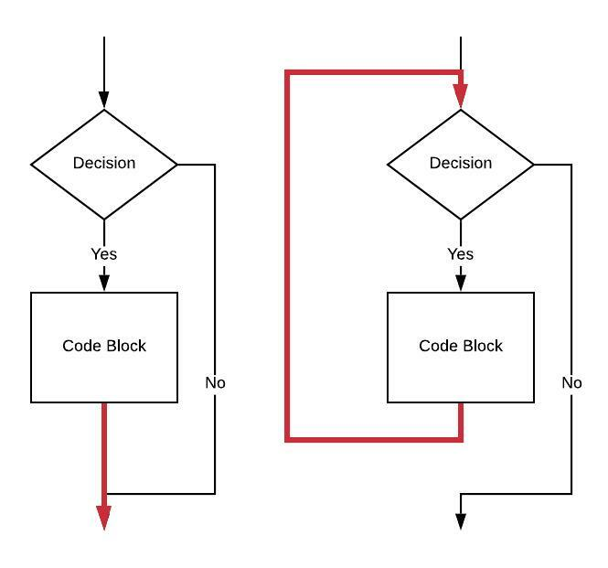
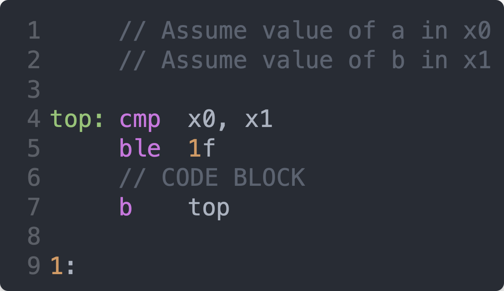

# While Loops

## Attribution

This work is created by Perry Kivolowitz, Professor and Chair of Computer Science at Carthage College. It is copyright © 2021 and may be freely
shared for educational purposes.

## Overview

We have already covered [the `if`](./if.md) statement. A `while` loop is exactly the same with the addition of one branch and one label. It really is that simple.

To illustrate this, here is a flow chart of an `if` statement (on the left) compared to a `while` loop (on the right).

The closing brace in an `if` statement is indicated by the red arrow head. This isn't a branch, the code flow simply falls through to the statement beyond the closing brace. In the `while` loop, the behavior of the closing brace changes to be that of a branch back to prior to the evaluation of a boolean condition (the "Decision").

The new label is placed before evaluating the "Decision". The new unconditional branch is placed after the end of the "Code Block."

For review, here is the assembly language for an `if` statement:

Here is the code for the `while` showing one new label and one new unconditional branch:

The label `top` could have been a temporary label.
